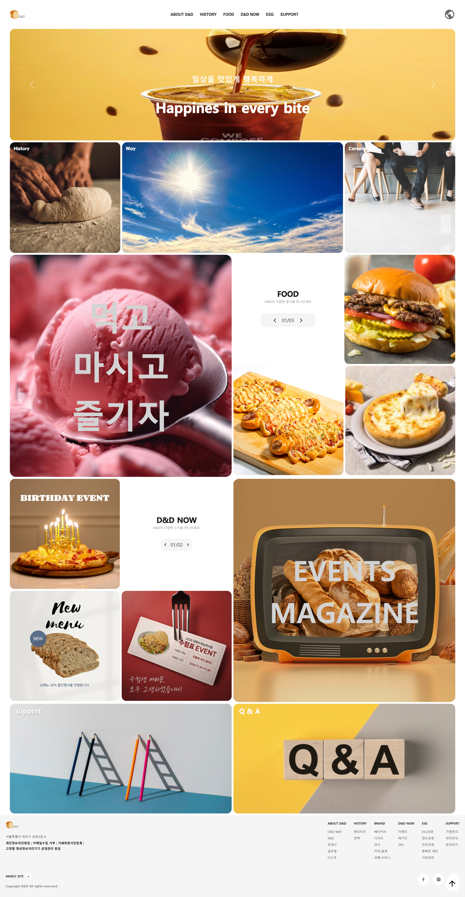
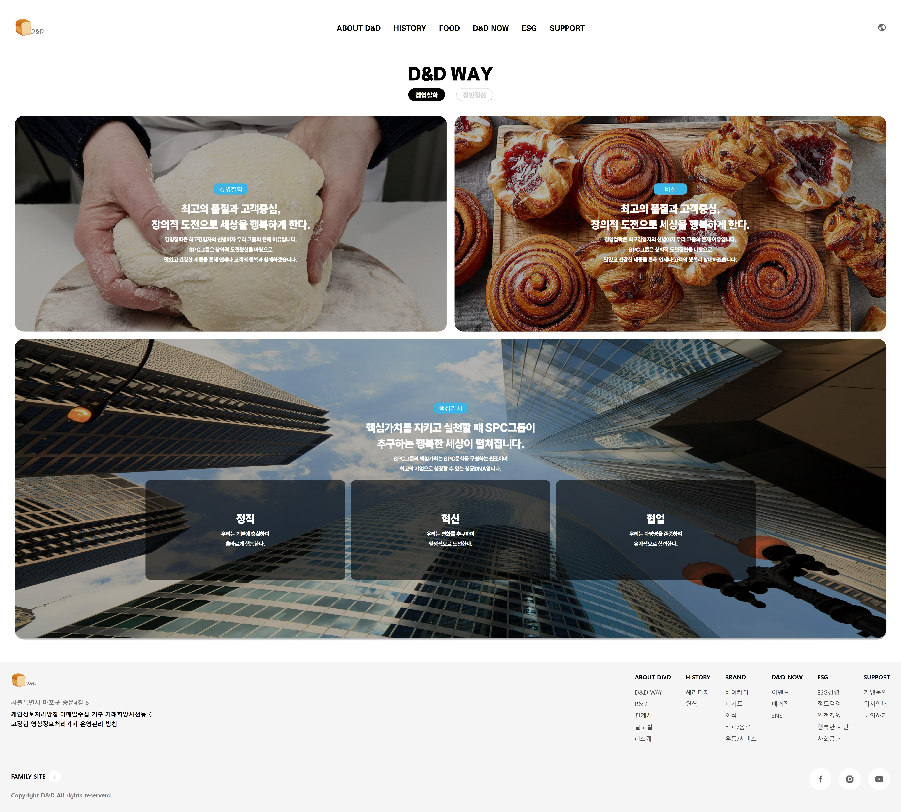
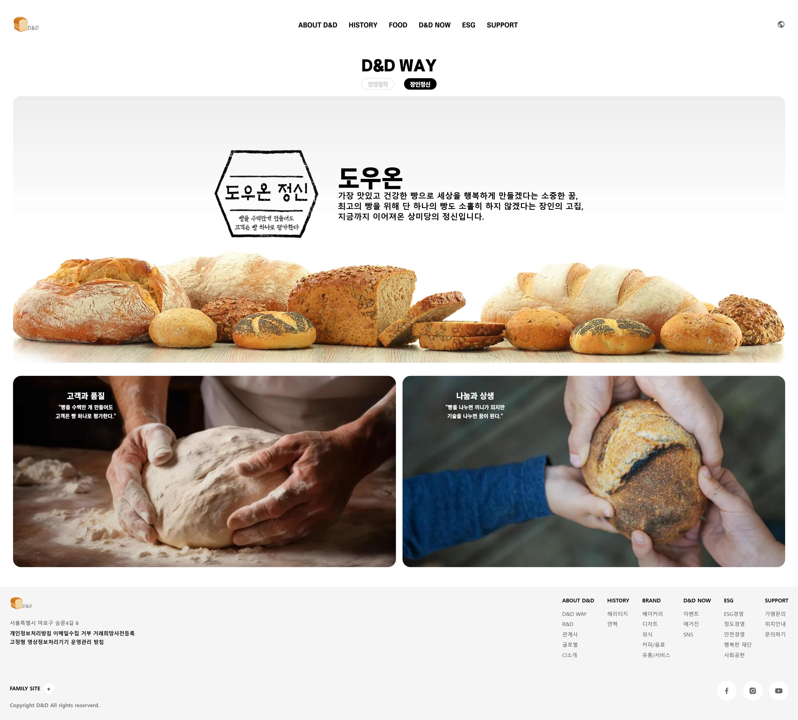

# D&D_ProJect

2025.01.06 ~ 2025.01.15 

 

 

## 🔗 목차

1. [기술스택](#-기술-스택)
2. [D&D란?]
3. [기획의도](#-기획-의도)
4. [전체 UI](#-전체-ui)
5. [주요 기능](#-주요-기능들)
6. [힘들었던 점](#-힘들었던-점)

    
    

## 🛠 기술 스택

 
 

  
  
  
  
  

 
 

## 📚 기획 의도

 
 

베이커리 회사를 차린다면 대형 브랜드의 홈페이지처럼 온라인으로 쉽게 정보를 알 수 있는 

홈페이지를 만들어보자 라는 생각이 들어 베이커리 홈페이지를 기획하게 되었습니다.

 
 

## D&D 란?

- Dough & Dream 의 약자로 이번 프로젝트를 잘 마무리 하고자 하는 뜻입니다.

 

## 📐 전체 UI

- reference: 파리바게트,삼립,베스킨라빈스를 자회사로 두고있는 SPC를 선택하였습니다.

 
 

 

## 💡 주요 기능들

 

### 🧡텍스트 클릭 시 이미지 변화

- 이미지 위의 텍스트 클릭 시 겹쳐 놓은 이미지들에 클래스를 추가해 나타나게 합니다.

 

 

### 🧡next 버튼 클릭 시 이미지 변화

- next 버튼 클릭 시 미리 만들어둔 배열에서 해당하는 페이지의 이미지를 가져옵니다.
- 이미지를 가져옴과 동시에 이미지의 페이지 숫자도 바뀝니다.
- 페이지 숫자는 최대값을 넘어가면 1로 돌아옵니다.

 

 

### 💚요소가 화면에 들어오면 사진 나오기

- 요소들을 감시하다가 사용자의 화면에 50% 노출 시 숨겨져 있던 요소가 나타납니다
- 애니메이션 효과를 사용해서 부드럽게 나타나게 합니다.

 

 

### 💙Url 이동하기

- 이동 가능한 배너 클릭 시 해당 URL로 이동합니다.

 

 

### 💙페이지 밑에서 제일 위로 올리는 버튼

- 버튼 클릭 시 페이지의 제일 위로 스크롤 되서 올라갑니다.
- 제일 위에서는 보이지 않고 50%를 내려가면 버튼이 나타납니다.

 

 

### 💙스크롤 시 네비 강조

- 현재 스크롤의 위치를 구해 실시간으로 현재있는 구간의 네비를 강조합니다.

 

 

### 💙네비 클릭 시 해당 위치 이동

- 네비 클릭 시 미리 지정해놓은 스크롤의 위치로 이동합니다.

 

 

### 💙세션 전환

- 아 이건 모르겠어요

 

 

## 📃 힘들었던 점

- 처음 공동작업을 하게되어서 GitHub를 사용하는 과정에서 충돌이 있었지만 이번 기회를 통해 사용법을 알게 되었습니다.
   
- 첫 프로젝트였기 떄문에 js로 함수를 만드는 게 익숙하지 않았지만 이번 기회로 더 알아가게 되었습니다.
