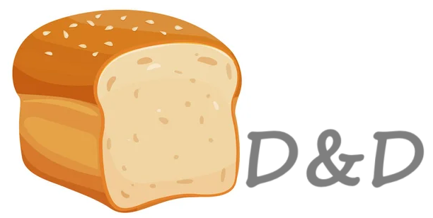

# D&D_ProJect

2025.01.06 ~ 2025.01.15 

 

 

## 🔗 목차

1. [기술스택](#-기술-스택)
2. [D&D란?](#-dd-란)
3. [기획의도](#-기획-의도)
4. [전체 UI](#-전체-ui)
5. [주요 기능](#-주요-기능들)

    
    

## 🛠 기술 스택

 
 

  
  
  
  
  

 
 

## 📚 기획 의도

 
 

베이커리 회사를 차린다면 대형 브랜드의 홈페이지처럼 온라인으로 쉽게 정보를 알 수 있는 

홈페이지를 만들어보자 라는 생각이 들어 베이커리 홈페이지를 기획하게 되었습니다.

 
 

## 💎 D&D 란?

- 작은 반죽으로 시작하는 여정의 의미인 Dough & Dream 의 약자로 이번 프로젝트를 잘 마무리 하고자 하는 뜻입니다.

 

## 📐 전체 UI

- reference: 파리바게트,삼립,베스킨라빈스를 자회사로 두고있는 SPC를 선택하였습니다.

 
 

 

## 💡 주요 기능들

 

### 🧡텍스트 온클릭 시 이미지 변화

- 이미지 위의 텍스트 온클릭 시 opacity가 0인 해당 요소에 opacity가 1인 클래스 추가 

 

 

### 🧡next 버튼 온클릭 시 이미지 변화

- next 버튼 온클릭 시 js 이미지 배열에서 해당하는 페이지의 이미지를 가져옴
- 이미지를 가져옴과 동시에 페이지 숫자도 +1 또는 -1
- 페이지의 max값을 넘기면 1로 초기화

 

 

### 💚요소가 화면에 들어오면 none에서 block으로 변경

- 요소들을 감시하다가 사용자의 화면에 50% 노출 시 클래스를 block으로 변경

 

 

### 💙Url 이동하기

- 이동 가능한 배너 클릭 시 해당 URL로 이동

 

 

### 💙탑 버튼

- 버튼 온클릭 시 페이지의 top:0의 위치로 이동
- 페이지의 위에서는 none이고 50% 이상 스크롤 할 시 block으로 변경

 

 

### 💙스크롤 위치의 요소 강조

- 현재 스크롤의 위치에 있는 요소를 강조

 

 

### 💙네비 클릭 시 해당 요소로 이동

- 네비 클릭 시 해당 요소의 위치로 이동

 

 

### 💙세션 전환

- 탭 기능 구현

 

 
